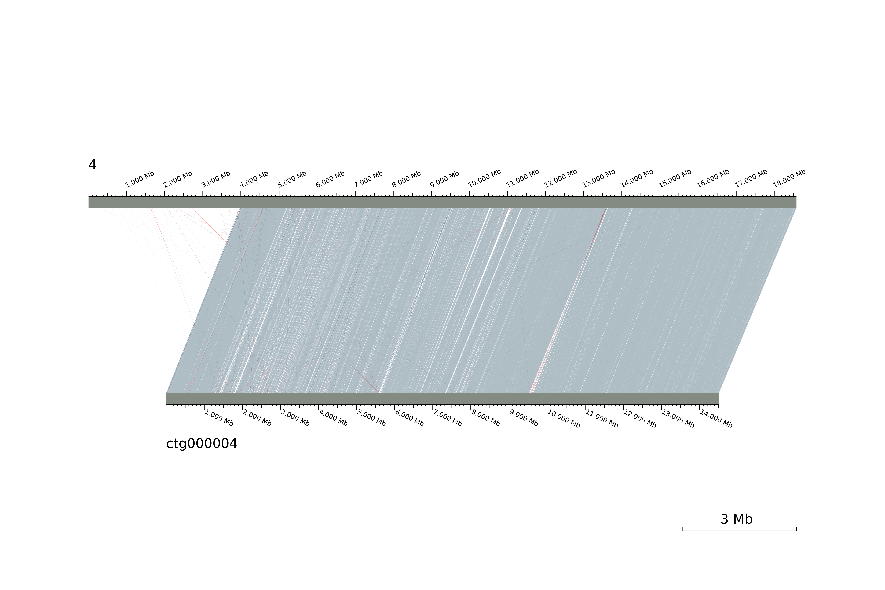
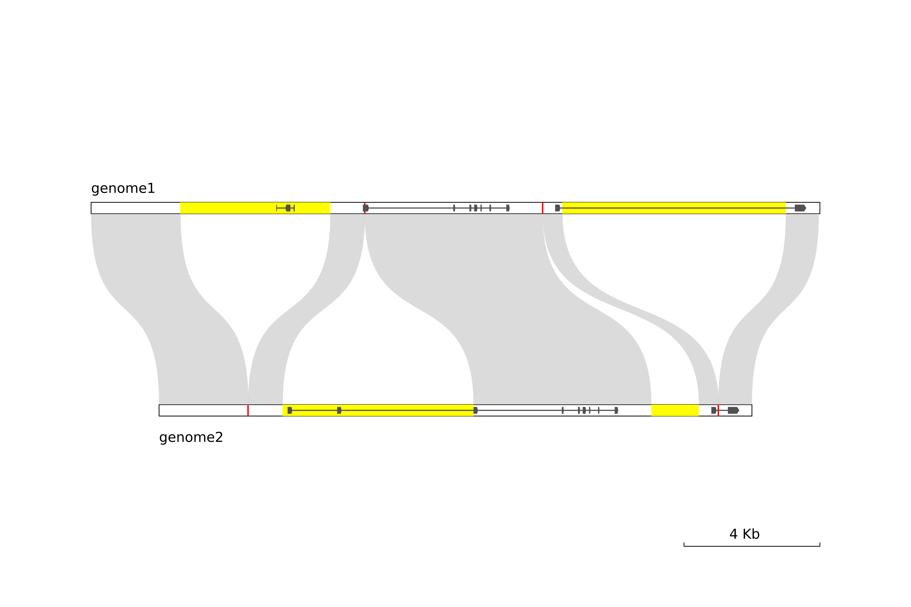

最新提示：请使用 [LINKVIEW2](https://github.com/YangJianshun/LINKVIEW2)

# LINKVIEW

LINKVIEW 是一个将序列比对结果（或其它任何适合的数据）进行可视化作图的工具。
本工具设计灵感来源于 circo s软件，因为在日常工作中需要对 blast 比对结果进行可视化显示，但是找不到合适的软件(circos 仅能作环状的图)，所以开发了这款工具。
使用 LINKVIEW 可以绘制出整体或局部的比对情况，支持自定义高亮、导入 gff 文件以绘制基因结构、有多种风格供选择。请看效果图：



### 项目依赖
#### python
python3.5+
#### cairosvg
cairosvg 是一个 python 模块，可以通过`pip3 install cairosvg`安装。
将 svg 渲染成 png 的时候需要调用 cairosvg 模块。
#### inkscape
将 svg 渲染为 png 的时候，可以使用 inkscape，在 inkscape 0.91 测试通过。
指定参数 `--svg2png inkscape` 使用 inkscape，若不指定，则无此依赖

### 使用方法说明

1. 输入文件 
    在使用 LINKVIEW 作图前，需要先准备一个（或多个） alignment 文件，可以自定义，也可以直接使用 blastn 或 MUMmer 的比对结果。
    自定义的输入文件格式如下：
    ```chr1 start1 end1 chr2 start2 end2 [color:opacity]```
    该文件每行为一个 alignment。
    chr1 和chr2 表示序列(染色体)名称；
    start1、end1、start2、end2为位点位置(bp，整数)，表示 chr1 的 start1 到 end1 比对上 chr2 的 start2 到 end2；
    color:opacity 表示该比对块绘制的颜色和透明度，可以省略，缺省值按照指定的风格有所不同。
    
    

     可以直接将比对软件的输出作为LINKVIEW的输入文件，目前支持blastn(tabular格式，见example3) 和 MUMmer(show-coords生成的文件，见example1)，
     以及 minimap2(paf格式)
    
    

    当准备好输入文件后，即可运行 LINKVIEW：
    ```
    ./LINKVIEW.py [-t TYPE] input
    ```

2. KARYOTYPE 文件 
    若不指定 KARYOTYPE 文件，LINKVIEW 会绘制输入文件中的所有染色体，并自动分配它们在图中的位置。
    通过-k参数指定一个 KARYOTYPE 文件，可以指定需要绘制的染色体及其在图中的位置和所需绘制的区间。
    KARYOTYPE 格式下：
    
    ```
    chr1[:start1:end1] chr2[:start2:end2]
    chr3[:start3:end3]
    ```
    每一行对应图中的每一横排，上面内容的含义是将chr1和chr2绘制在第一横排，且 chr1 在左，chr2 在右，chr3 绘制在第二横排；
    start和end指定需要绘制的该染色体的区间，可以省略，若省略，则LINKVIEW会根据输入文件计算出包含所有 alignment 的最小区间。
    
3. HIGHLIGHT文件 
    LINKVIEW 可以将染色体上部分区段高亮显示。
    通过 -hl参数指定一个 HIGHLIGHT 文件，格式如下：
    
    ```
    chr start end [color]
    ```
    该文件每一行表示一个高亮区块，上面内容表示 chr 的 start 到 end 区间显示为高亮，
    颜色可以省略，默认颜色为 red
    
4. CHR_LEN 文件 
   通过 --chr_len 参数指定 CHR_LEN 文件，格式如下：
   
    ```
    chr1 len1
    chr2 len2
    ```
    该文件指定每条染色体的长度，如果指定该文件，KARYOTYPE文件中指定的染色体区间不完整展示时，没展示的部分将以一条短横线代替
   
5. 其它参数 
   
  <table>
  <tr>
		<th>-o, --output</th>
		<td>输出文件的前缀</td>
	</tr>
	<tr>
    <th>-n, --no_label</th>
		<td>不显示标签</td>
	</tr>
	<tr>
    <th>--label_font_size</th>
    <td>标签字体大小</td>
  </tr>
	<tr>
    <th>--label_angle</th>
    <td>标签旋转角度</td>
  </tr>
	<tr>
    <th>--chro_axis</th>
    <td>显示刻度(仅对第一横排和最后一横排有效)</td>
  </tr>
	<tr>
    <th>--chro_axis_density</th>
    <td>大于0的值，对于控制刻度的稠密程度有一定作用</td>
  </tr>
  <tr>
    <th>--show_pos_with_label</th>
    <td>显示标签的同时，也显示染色体的区间位置信息</td>
  </tr>
  <tr>
    <th>--scale</th>
    <td>在右下角绘制的比例尺线段图例的大小，默认为自动大小</td>
  </tr>
  <tr>
    <th>--gff</th>
    <td>指定gff文件以绘制基因结构</td>
  </tr>
  <tr>
    <th>--bezier</th>
    <td>比对块绘制成贝塞尔曲线风格</td>
  </tr>
  <tr>
    <th>--style</th>
    <td>改变绘图风格，目前有两种样式分别是classic和simple，前者颜色较深，后者较浅</td>
  </tr>
  <tr>
    <th>--min_identity</th>
    <td rowspan="43">用于过滤alignment</td>
  </tr>
  <tr>
    <th>--min_alignment_length</th>

  </tr>
  <tr>
    <th>--max_evalue</th>
    
  </tr>
  <tr>
    <th>--min_bit_score</th>
  </tr>
</table>

值得注意的是，可以通过 -p 指定 PARAMETER 文件，为每一横排指定参数，PARAMETER 文件的每一行对应作图的每一横排，格式为parameter=value，例如：
```
chro_axis=1 label_angle=30
label_font_size=20
```
上面内容的含义是，作图的第一横排显示刻度，标签旋转30°，第二横排字体大小为20px。

<hr>
联系邮箱：

shunlintianxia@sina.com

397441459@qq.com


​         

